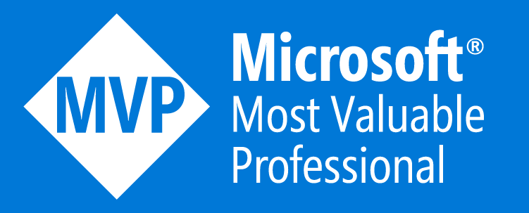

### Hi there I'm John Lokerse 👋

 - ⚒ DevOps Consultant at [Rubicon Cloud Advisor](https://rubicon.nl/)
 - Microsoft MVP on DevOps and Microsoft Infrastructure-as-Code
 - 🚀 Working with Azure DevOps, GitHub and Infrastructure-as-Code
 - Azure Bicep enthusiast!

### Blogging on Azure Bicep and Azure DevOps at [https://www.johnlokerse.dev/](https://www.johnlokerse.dev/)
Follow me on LinkedIn: 

---
### Stats

